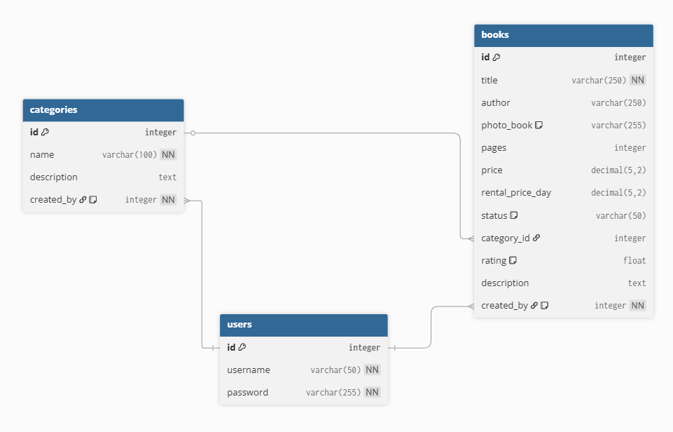

# Capstone Project

## Library Management System

### 📘 Project Description

The **Library Management System** is a Django-based web application designed to help libraries efficiently manage their books, categories, and

**Main Features:**

* Manage books (Create, Read, Update, Delete).
* Organize books by categories.
* Admin authentication (login/logout).
* Upload and display book images.
* Basic search for books and categories..

**Project Importance:**
Project Importance:
Helps libraries keep track of books and categories in an organized way.

---

### 👩‍💼 User Stories

#### For Admin:

* As an admin, I want to log in to the system to manage the library efficiently.
* As an admin, I want to add new books with images and categories.
* As an admin, I want to edit or update existing books and categories.
* As an admin, I want to delete books or categories that are no longer needed.
* As an admin, I want to view lists and statistics of books and categories.

---

### 🧩 ERD (Entity Relationship Diagram)

